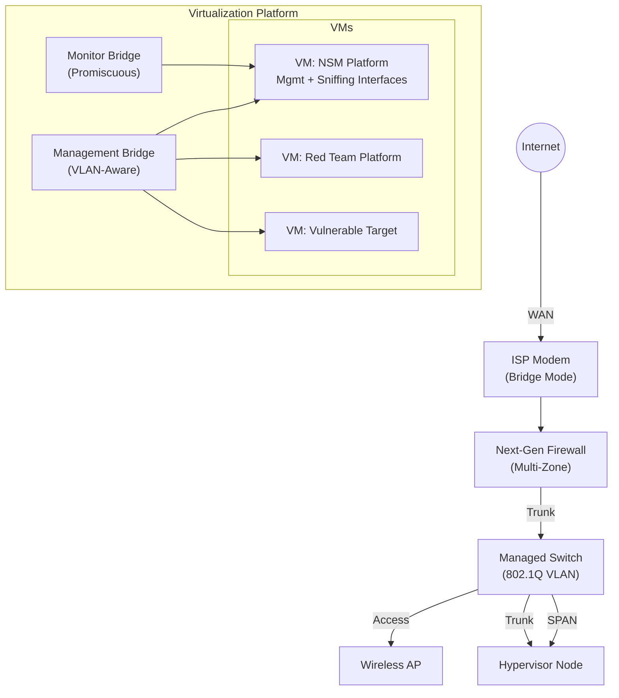

# Enterprise-Grade Network Security Monitoring & Threat Detection Lab

**A production-grade hybrid physical-virtual SOC environment demonstrating advanced network defense, threat detection engineering, and Infrastructure as Code automation.**

---

## Executive Summary

This repository documents a fully operational home lab built to SOC engineering standards. It proves practical competency in network security monitoring (NSM), zero-trust segmentation, out-of-band traffic analysis, and automated infrastructure deployment—skills directly transferable to enterprise blue team and detection engineering roles.

**Business Value Proposition:**
- **Threat Detection Engineering:** Real-time intrusion detection via Security Onion using Zeek and Suricata correlation against live attack traffic.
- **Network Segmentation Strategy:** Multi-zone architecture isolating production, SOC infrastructure, attack simulation, and vulnerable victim environments with explicit deny-by-default policies.
- **Zero-Trust Enforcement:** Firewall rules that prevent lateral movement from compromised segments while maintaining full visibility through hardware SPAN mirroring.
- **Operational Automation:** Terraform-managed VMs eliminating configuration drift and enabling repeatable SOC deployments.
- **Hands-On IR Workflow:** Complete attack → detect → triage lifecycle with MITRE ATT&CK mapping and forensic documentation.

---

## Network Architecture Diagram

### High-Level Topology

### Network Segmentation Model

INTERNET
                          │
                          ▼
                ┌─────────────────────┐
                │   Edge Router/Modem │
                │   (ISP Connection)  │
                └──────────┬──────────┘
                           │
                           ▼
        ┌──────────────────────────────────────┐
        │   Stateful Firewall (NGFW)           │
        │  ┌────────────────────────────────┐  │
        │  │ LAN Interface (Production)    │  │
        │  │ VLAN 10: SOC/Monitoring       │  │
        │  │ VLAN 20: IoT/Isolated         │  │
        │  │ VLAN 30: Attack Simulation    │  │
        │  │ VLAN 40: Victim Environment   │  │
        │  │ VLAN 80: Trusted Wireless     │  │
        │  └────────────────────────────────┘  │
        └──────────────┬───────────────────────┘
                       │ 802.1Q Trunk
                       ▼
  ┌────────────────────────────────────────────┐
  │   Managed Switch (Layer 2+)                │
  │  ┌──────────────────────────────────────┐  │
  │  │ Port 1: Firewall Trunk              │  │
  │  │ Port 2: Access Port (WiFi AP)       │  │
  │  │ Port 3: Hypervisor Trunk            │  │
  │  │ Port 4: SPAN Mirror Destination     │  │
  │  │ Port 5: Reserved                     │  │
  │  └──────────────────────────────────────┘  │
  │  SPAN: Ports 1,2 → Port 4                 │
  └───┬─────────────────────┬──────────────────┘
      │                     │
      ▼                     ▼

┌─────────────────────────────────────────────────────┐
│      Hypervisor Platform (Type 1)                   │
│  ┌───────────────────────────────────────────────┐  │
│  │ Bridge 0: Production + VLAN Trunk            │  │
│  │ Bridge 1: Out-of-Band Monitoring (SPAN)     │  │
│  └───────────────────────────────────────────────┘  │
│                                                      │
│  ┌──────────────────────────────────────────────┐  │
│  │ VM 1: NSM Sensor                             │  │
│  │  ├─ NIC0 → Management (VLAN 10)             │  │
│  │  └─ NIC1 → Sniffing (Promiscuous)           │  │
│  │  Resources: 4 vCPU, 16GB RAM, 300GB Storage │  │
│  └──────────────────────────────────────────────┘  │
│                                                      │
│  ┌──────────────────────────────────────────────┐  │
│  │ VM 2: Attack Simulation Platform             │  │
│  │  └─ NIC0 → Attack Lab (VLAN 30)             │  │
│  └──────────────────────────────────────────────┘  │
│                                                      │
│  ┌──────────────────────────────────────────────┐  │
│  │ VM 3: Intentionally Vulnerable Target        │  │
│  │  └─ NIC0 → Victim Network (VLAN 40)         │  │
│  └──────────────────────────────────────────────┘  │
└──────────────────────────────────────────────────────┘
TRAFFIC FLOW LEGEND:
═══════════════════════════════════════════════════════
Management Traffic:   VLAN 10 → NSM Management Interface
SPAN Mirror Traffic:  Switch Port Mirroring → NSM Sniffing Interface
Attack Traffic:       VLAN 30 → VLAN 40 (Controlled & Monitored)
Blocked Traffic:      VLAN 30/40 ✗→ Production Networks

---

## Deep Dive Technical Analysis & Design Rationales

### 1. Network Isolation & Zero-Trust Enforcement

**Network Segmentation Model:**

| Zone | VLAN | Purpose | Trust Level |
|------|------|---------|-------------|
| Production | 1 | Primary user network | High |
| SOC/Monitoring | 10 | Security infrastructure | Critical |
| Attack Lab | 30 | Red team simulation | Untrusted |
| Victim Lab | 40 | Vulnerable targets | Untrusted |
| Wireless | 80 | Trusted wireless clients | Medium |
| IoT | 20 | Smart devices | Low |

**Firewall Policy Framework:**

- Priority 1: SOC Internet Access    → NSM sensors require threat feed updates
- Priority 2: Management Access      → Administrative access from trusted networks
- Priority 3: Inter-Zone Production  → Controlled communication between trusted zones
- Priority 4: Attack→Victim Flow     → Permit attack traffic for detection testing
- Priority 5: Lab Containment        → DROP all traffic from attack/victim to production
- Priority 6: Default Deny           → Explicit deny-all at bottom of rule stack

**Design Rationale:**

**Controlled Attack Surface:** Attack simulation traffic is explicitly permitted to vulnerable targets, generating realistic threat telemetry for detection validation.

**Victim Containment:** Post-compromise, the victim environment is completely isolated from production networks and SOC infrastructure, demonstrating defense-in-depth.

**Attack Lab Isolation:** The red team platform cannot reach production assets, preventing accidental lateral movement during testing.

**Zero-Trust NAT:** Internal zones do not perform address translation between each other, maintaining source IP integrity for forensic analysis.

---

### 2. SPAN Port Mirroring – Out-of-Band Detection

**Traffic Capture Architecture:**

The managed switch employs port mirroring (SPAN) to duplicate all traffic from critical network segments (firewall trunk + wireless AP) to a dedicated monitoring port. This port connects to a dedicated network interface on the hypervisor, bypassing the production data path entirely.

**Traffic Flow:**

