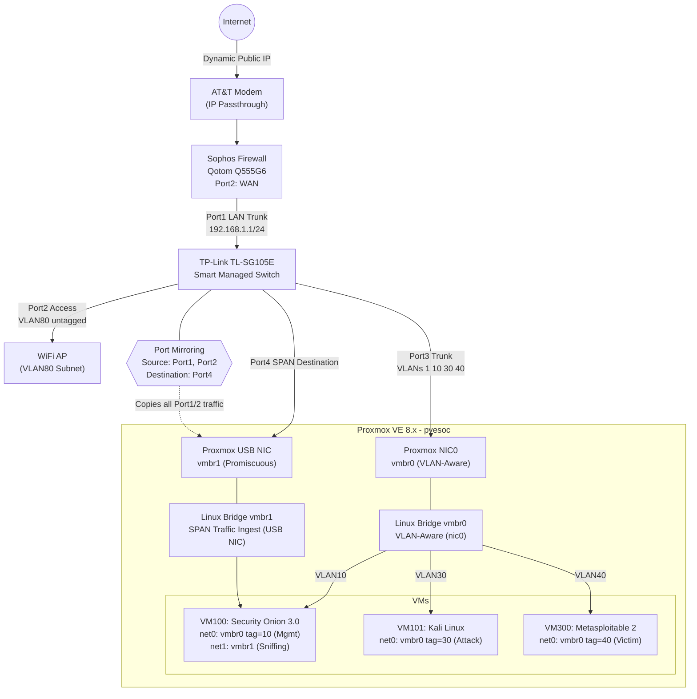

# Enterprise-Grade Network Security Monitoring & Threat Detection Lab

**A production-grade hybrid physical-virtual SOC environment demonstrating advanced network defense, threat detection engineering, and Infrastructure as Code automation.**

**Quick Links:** [Architecture Diagram](#network-architecture-diagram) | [Deep-Dive Analysis](#deep-dive-technical-analysis--design-rationales) | [Threat Simulation Guide](#lab-execution-guide-end-to-end-threat-simulation) | [Terraform Code](terraform/) | [Deployment Notes](#deployment-notes--troubleshooting)

---

## Executive Summary

This repository documents a fully operational home lab built to SOC engineering standards. It proves practical competency in network security monitoring (NSM), zero-trust segmentation, out-of-band traffic analysis, and automated infrastructure deployment—skills directly transferable to enterprise blue team and detection engineering roles.

**Business Value Proposition:**
- **Threat Detection Engineering:** Real-time intrusion detection via Security Onion 3.0 using Zeek and Suricata correlation against live attack traffic.
- **Network Segmentation Strategy:** Multi-zone architecture isolating production, SOC infrastructure, attack simulation, and vulnerable victim environments with explicit deny-by-default policies.
- **Zero-Trust Enforcement:** Firewall rules that prevent lateral movement from compromised attack or victim segments while maintaining full visibility through hardware SPAN mirroring.
- **Operational Automation:** Terraform-managed VMs eliminating configuration drift and enabling repeatable SOC deployments.
- **Hands-On IR Workflow:** Complete attack → detect → triage lifecycle with MITRE ATT&CK mapping and forensic documentation.

---

## Network Architecture Diagram

### Interactive Mermaid.js (renders natively on GitHub)

### Detailed ASCII Diagram

INTERNET
                              │
                              ▼
                    ┌─────────────────────┐
                    │   AT&T Fiber Modem  │
                    │  (IP Passthrough)   │
                    └──────────┬──────────┘
                               │
                               │ WAN (Dynamic Public IP)
                               ▼
            ┌──────────────────────────────────────┐
            │  Sophos XG Firewall (Qotom Q555G6)   │
            │  ┌────────────────────────────────┐  │
            │  │ Port1 (LAN): 192.168.1.1/24   │  │
            │  │ VLAN10: 192.168.10.1/24 (SOC) │  │
            │  │ VLAN20: 192.168.20.1/24 (IoT) │  │
            │  │ VLAN30: 192.168.30.1/24 (ATK) │  │
            │  │ VLAN40: 192.168.40.1/24 (VIC) │  │
            │  │ VLAN80: 192.168.80.1/24 (WiFi)│  │
            │  └────────────────────────────────┘  │
            └──────────────┬───────────────────────┘
                           │ Trunk (802.1Q Tagged)
                           ▼
      ┌────────────────────────────────────────────┐
      │   TP-Link TL-SG105E (Managed Switch)       │
      │  ┌──────────────────────────────────────┐  │
      │  │ Port 1: Trunk (VLAN 1,10,30,40,80)   │  │
      │  │ Port 2: Access WiFi AP (VLAN 80)     │  │
      │  │ Port 3: Trunk to Proxmox (VLANs)     │  │
      │  │ Port 4: SPAN Mirror Destination      │  │
      │  │ Port 5: Reserved                     │  │
      │  └──────────────────────────────────────┘  │
      │  SPAN Config: Ports 1,2 → Port 4          │
      └───┬─────────────────────┬──────────────────┘
          │                     │
 Port 3   │                     │ Port 4 (SPAN Stream)
          ▼                     ▼

┌─────────────────────────────────────────────────────┐
│      Dell OptiPlex 3040 (Proxmox VE 9.1.11)         │
│  ┌───────────────────────────────────────────────┐  │
│  │ vmbr0 (nic0) ←─ Port 3 (VLAN-aware bridge)   │  │
│  │ vmbr1 (USB NIC) ←─ Port 4 (Promiscuous)      │  │
│  └───────────────────────────────────────────────┘  │
│                                                      │
│  ┌──────────────────────────────────────────────┐  │
│  │ VM 100: Security Onion 3.0.0                 │  │
│  │  ├─ net0 → vmbr0.10 (192.168.10.x)          │  │
│  │  │   Management Interface (SSH/WebUI)        │  │
│  │  └─ net1 → vmbr1 (Promiscuous Mode)         │  │
│  │      Sniffing Interface (Zeek/Suricata)     │  │
│  │  Resources: 4 vCPU, 16GB RAM, 300GB Storage │  │
│  └──────────────────────────────────────────────┘  │
│                                                      │
│  ┌──────────────────────────────────────────────┐  │
│  │ VM 101: Kali Linux (Attack Platform)         │  │
│  │  └─ net0 → vmbr0.30 (192.168.30.x)          │  │
│  └──────────────────────────────────────────────┘  │
│                                                      │
│  ┌──────────────────────────────────────────────┐  │
│  │ VM 300: Metasploitable 2 (Victim)            │  │
│  │  └─ net0 → vmbr0.40 (192.168.40.x)          │  │
│  └──────────────────────────────────────────────┘  │
└──────────────────────────────────────────────────────┘
TRAFFIC FLOW LEGEND:
═══════════════════════════════════════════════════════
Management Traffic:   vmbr0.10 → Security Onion net0
SPAN Mirror Traffic:  Switch Port 4 → USB NIC → vmbr1 → Security Onion net1
Attack Traffic:       Kali (VLAN30) → Metasploitable (VLAN40) [allowed]
Blocked Egress:       Victim (VLAN40) ✗→ SOC (VLAN10), LAN, WiFi

---

## Deep Dive Technical Analysis & Design Rationales

### 1. Network Isolation & Zero-Trust Enforcement

**Firewall Zone Bindings:**

| Zone | Members | Subnet | Purpose |
|------|---------|--------|---------|
| LAN | Port1, VLAN20 | 192.168.1.0/24 | Production / management |
| Security_Onion_Lab | VLAN10 | 192.168.10.0/24 | SOC infrastructure (monitoring) |
| ATTACK_LAB | VLAN30 | 192.168.30.0/24 | Adversary emulation (Kali) |
| Victim_Lab | VLAN40 | 192.168.40.0/24 | Vulnerable targets (Metasploitable) |
| LAN_PRIVATE | VLAN80 | 192.168.80.0/24 | Trusted wireless clients |

**Firewall Rules (Top-Down Logic):**

Rule 2  (Lab_to_Internet)        : Security_Onion_Lab → WAN  [Accept]
Rule 4  (Wifi_to_LAN_Mgmt)       : LAN_PRIVATE → LAN (HTTPS, SSH) [Accept]
Rule 5  (LAN_to_Lab)             : LAN → LAN, LAN_PRIVATE, Security_Onion_Lab [Accept]
Rule 6  (Allow LAN to Internet)  : LAN, LAN_PRIVATE → WAN [Accept]
Rule 8  (Wifi_to_Lab)            : LAN_PRIVATE → Security_Onion_Lab [Accept]
Rule 10 (MyPC_to_Prox_Server)    : LAN_PRIVATE → LAN (HTTPS, SSH, TCP) [Accept]
Rule 11 (Attack_Lab_to_Main)     : ATTACK_LAB → LAN, Security_Onion_Lab, Main_LAN_Subnet [DROP]
Rule 12 (Attack_Lab_to_wifi)     : ATTACK_LAB → LAN_PRIVATE [DROP]
Rule 13 (Attack_to_Victim)       : ATTACK_LAB → Victim_Lab [ACCEPT]
Rule 14 (Victim_to_SOC)          : Victim_Lab → Security_Onion_Lab [DROP]
Rule 15 (Victim_to_LAN)          : Victim_Lab → LAN, LAN_PRIVATE [DROP]
Rule 16 (Victim_to_WAN)          : Victim_Lab → WAN [DROP]
Rule 17 (Default Drop)           : Any → Any [DROP]

**Design Rationale:**

**Controlled Attack Surface:** Rule 13 permits Kali (VLAN30) to scan and exploit Metasploitable (VLAN40) so that a full kill chain can be demonstrated. The traffic is fully bidirectional, yielding complete PCAPs for analysis.

**Victim Containment:** Despite the successful exploitation, Rules 14–16 prevent the compromised victim from pivoting to the SOC sensor (VLAN10) or the home network (VLAN1/80). This is a classic DMZ-style isolation applied to a lab environment.

**Attack Lab Sandbox:** Rules 11 and 12 continue to restrict Kali itself from reaching anything other than its intended victim, preventing accidental exposure.

**NAT Policy Hardening:** An `Internal_No_NAT` policy blocks NAT between internal zones, ensuring source IP fidelity in logs.

**Note on Gateway Pingability:** From the Attack Lab, you may be able to ping the Sophos firewall's interface IPs (e.g., 192.168.10.1) because the firewall's own addresses are not covered by the DROP rules that target network objects. However, actual device IPs (like Metasploitable at 192.168.40.200 or a WiFi laptop at 192.168.80.53) are unreachable, confirming the intended isolation.

---

### 2. SPAN / Port Mirroring – Out-of-Band Detection

The TP-Link TL-SG105E switch mirrors all ingress and egress traffic on Ports 1 (firewall trunk) and 2 (WiFi AP) to a dedicated destination (Port 4). This port connects to Proxmox's secondary USB NIC, bridged to `vmbr1`, and fed directly into Security Onion's promiscuous sniffing interface (`net1`).

**Why This Works for the Allowed Attack Flow:**

When Kali (VLAN30) exploits Metasploitable (VLAN40), the packets flow: