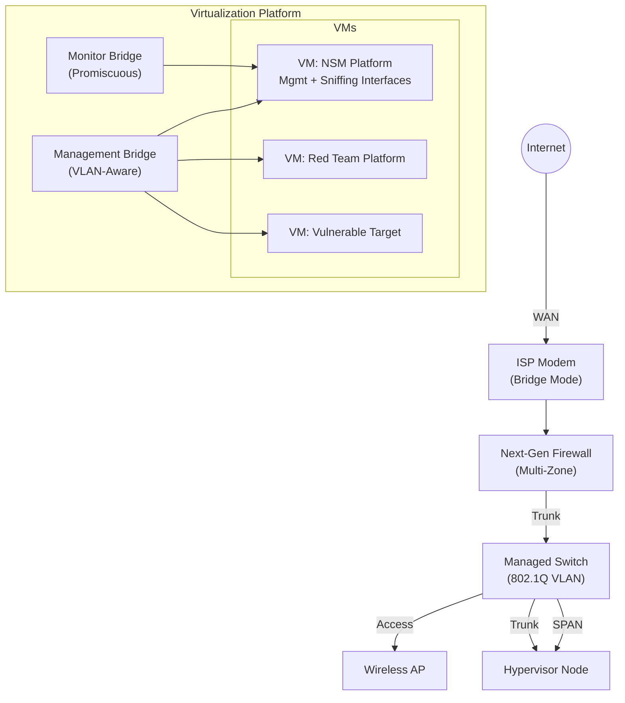

# Enterprise-Grade Network Security Monitoring & Threat Detection Lab

**A production-grade hybrid physical-virtual SOC environment demonstrating advanced network defense, threat detection engineering, and Infrastructure as Code automation.**

---

## Executive Summary

This repository documents a fully operational home lab built to SOC engineering standards. It proves practical competency in network security monitoring (NSM), zero-trust segmentation, out-of-band traffic analysis, and automated infrastructure deployment—skills directly transferable to enterprise blue team and detection engineering roles.

**Business Value Proposition:**
- **Threat Detection Engineering:** Real-time intrusion detection via Security Onion using Zeek and Suricata correlation against live attack traffic.
- **Network Segmentation Strategy:** Multi-zone architecture isolating production, SOC infrastructure, attack simulation, and vulnerable victim environments with explicit deny-by-default policies.
- **Zero-Trust Enforcement:** Firewall rules that prevent lateral movement from compromised segments while maintaining full visibility through hardware SPAN mirroring.
- **Operational Automation:** Terraform-managed VMs eliminating configuration drift and enabling repeatable SOC deployments.
- **Hands-On IR Workflow:** Complete attack → detect → triage lifecycle with MITRE ATT&CK mapping and forensic documentation.

---

## Network Architecture Diagram

### High-Level Topology

### Network Segmentation Model

INTERNET
                          │
                          ▼
                ┌─────────────────────┐
                │   Edge Router/Modem │
                │   (ISP Connection)  │
                └──────────┬──────────┘
                           │
                           ▼
        ┌──────────────────────────────────────┐
        │   Stateful Firewall (NGFW)           │
        │  ┌────────────────────────────────┐  │
        │  │ LAN Interface (Production)    │  │
        │  │ VLAN 10: SOC/Monitoring       │  │
        │  │ VLAN 20: IoT/Isolated         │  │
        │  │ VLAN 30: Attack Simulation    │  │
        │  │ VLAN 40: Victim Environment   │  │
        │  │ VLAN 80: Trusted Wireless     │  │
        │  └────────────────────────────────┘  │
        └──────────────┬───────────────────────┘
                       │ 802.1Q Trunk
                       ▼
  ┌────────────────────────────────────────────┐
  │   Managed Switch (Layer 2+)                │
  │  ┌──────────────────────────────────────┐  │
  │  │ Port 1: Firewall Trunk              │  │
  │  │ Port 2: Access Port (WiFi AP)       │  │
  │  │ Port 3: Hypervisor Trunk            │  │
  │  │ Port 4: SPAN Mirror Destination     │  │
  │  │ Port 5: Reserved                     │  │
  │  └──────────────────────────────────────┘  │
  │  SPAN: Ports 1,2 → Port 4                 │
  └───┬─────────────────────┬──────────────────┘
      │                     │
      ▼                     ▼

